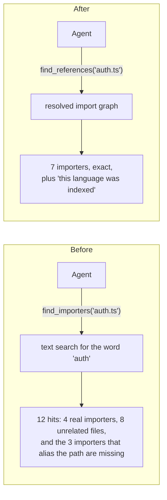
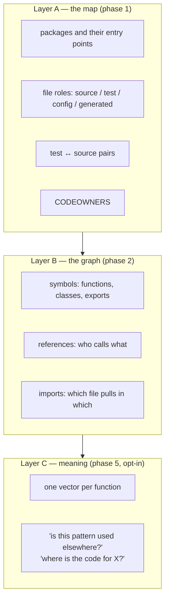
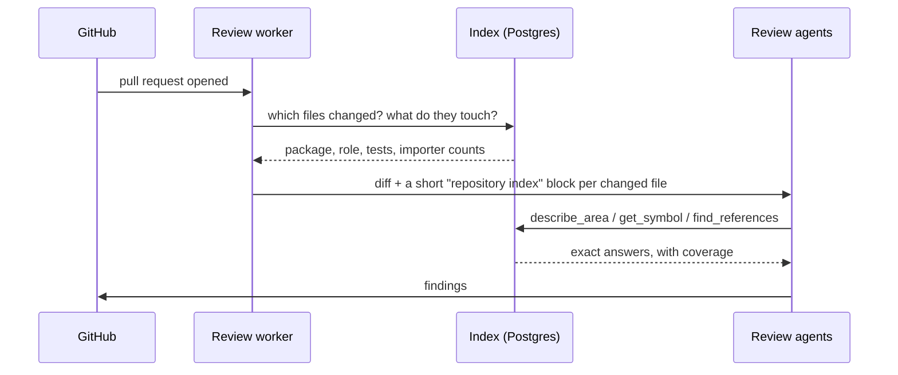
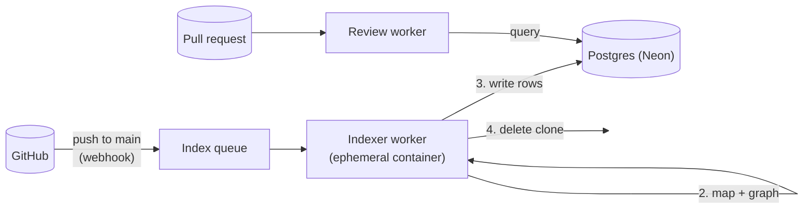
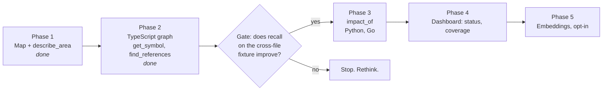

# The repository index, explained

A plain-language companion to `repo-index.md`. That file is the design; this
one is what it is, why it is shaped this way, and what it buys. Diagrams
render on GitHub.

## What it is

A map of a customer's repository that the review agents can ask questions of.

Today an agent reviewing a pull request sees the diff and can read files one
at a time. It cannot reliably answer *who calls this function*, *what tests
cover this file*, or *what else breaks if this changes* — it guesses with text
search. The index replaces the guess with an answer.

Think of it as two things stapled together:

- **A map** — which package every file belongs to, what role it plays
  (source, test, config, generated…), who owns it, which tests cover it.
- **A phone book** — every function, class and export, where it is defined,
  and every place that references it.

Both are built ahead of time from the repository's default branch and stored
on our side. When a pull request arrives, the agents look things up instead
of searching.

## The problem it solves

The old `find_importers` tool documented its own limits: *"a cheap proxy for
what imports it, NOT a resolved import graph… an empty result means the search
found nothing — never that nothing imports the file."* The agents had to be
told not to trust it. A review that cannot see callers cannot see blast
radius, and a change that breaks an untouched file is exactly what a human
reviewer catches and a diff-only reviewer does not.

## The three layers

Each layer answers questions the one below cannot, and each costs more:

| Layer | Built from | Answers | Cost |
|---|---|---|---|
| A — map | file names and manifests, no parser | *what is this file, who owns it, what tests it* | seconds, every language |
| B — graph | a real language indexer (SCIP) | *who calls this, what does it import, where is it defined* | a few seconds to minutes, per language |
| C — meaning | an embedding per function | *is this pattern repeated, where is the code for…* | model calls, opt-in per team |

Layer A exists for every repository. Layer B exists where we have an indexer
for the language. Layer C is a separate decision because it stores a
representation of the code, not just a location in it.

## How a review uses it

Two things happen. First, before any agent runs, the worker writes a few
deterministic lines into the opening message — *this file is in
`@acme/billing`, it is source, `billing.test.ts` covers it, 23 files import
it*. The agents get orientation for free. Second, the agents can ask the
index directly through three tools:

- **`describe_area(path)`** — the map entry for a file.
- **`get_symbol(path, name)`** — where a function or class is defined, and how
  many places point at it.
- **`find_references(path, name?)`** — every file importing a file, or every
  reference to a symbol, with line numbers.

Every answer carries a header saying which commit the index was built from,
how old it is, and which languages were covered. `known: false` means *the
index does not have this*, never *this does not exist*. If the index is
missing entirely, the tools say so in one line and the review runs on the
other tools. **The index can make a review better; it can never make one
fail.**

## Where it lives and how it gets there

- **Built on our side, not the customer's.** They install the App and pick
  repositories. No workflow file, no branch in their repository, no build
  step. That is the whole product promise.
- **Built from the default branch on push,** debounced so a busy repository
  does not rebuild every minute. A pull request is reviewed against the latest
  index, and files that changed since it was built are flagged as stale.
- **Stored in the Postgres we already run.** No new service. A build writes
  under a fresh id and flips a pointer when it succeeds, so a review never
  sees a half-built index.
- **Never stores source.** The clone is deleted after indexing. What remains
  is paths, names, kinds and line numbers. When an agent needs the body of a
  function, it reads it live from GitHub with the same token it already has.

## Why it is shaped this way

Each of these was a real fork in the road.

**Deterministic extraction, not an LLM building the graph.** The graph must be
reproducible, cheap and exactly right. A parser gives that; a model does not.
Models *use* the index; they never build it.

**A real language indexer (SCIP), not a hand-written parser.** The hard part of
"who imports this" is resolution — path aliases, barrel re-exports, Python
packages. SCIP indexers exist per language and have solved that. We decode a
standard format instead of maintaining one parser per language.

**Postgres, not a graph database, a document store or object storage.** The
queries are index lookups and bounded traversals, which relational databases
do well. We already run Neon; adding a second store means a second bill, a
second driver and a second thing to secure. If one table ever gets too big,
that one table moves; the design does not.

**Positions only.** Storing customer source is the largest liability a review
product carries. Storing "there is a function called `chargeCard` at line 41
of `billing.ts`, referenced from 23 files" is not. This is the sentence on the
security page, and Layer C is separate precisely because it would change it.

**Hosted, not inside the customer's CI.** The self-hosted action reads
everything over the API on purpose, so a pull request cannot influence its own
review. Building an index there would mean either a checkout — a trust-model
change — or parsing over the API, which is slow and rate-limited. The hosted
App has a trusted place to build it; the action gets the map layer only.

**Honest coverage on every answer.** An index that silently misses a language
is worse than none: the agent reads "no callers" as "safe". Every result
carries what was indexed and what was not.

## What it buys

For the customer:

- Findings that reach outside the diff — the caller in a file the pull request
  never touched, the test that no longer covers the change.
- Fewer false alarms from an agent guessing at structure it cannot see.
- Nothing to set up and nothing added to their repository.

For us:

- A capability the self-hosted tier does not have, which is what the paid tier
  is.
- A cheaper review: the agents spend turns *using* context instead of
  *finding* it. Today five agents each rediscover the same files; with the
  index the orchestrator can gather once and let every agent read from the
  same cached bundle.
- A foundation the next layers sit on — the review-history graph (which
  findings this repository ignores, which modules keep getting flagged) hangs
  off the same file and symbol ids, and Layer C embeddings ride on the same
  symbol boundaries.

## What it costs, honestly

- **Indexing compute** is the cost centre: one indexer run per default-branch
  push per repository, a few seconds for a service, minutes for a large
  monorepo. Debounced and capped per plan.
- **Storage** grows with edges. A moderate monorepo is a few million rows;
  a large one tens of millions. Fine until it is not; the escape hatch is
  written down.
- **Coverage is per language.** No indexer, no graph — the map still works.
- **The first pull request after install** may arrive before the index does.
  It is reviewed without one, and says so.

## Rollout

Each phase is gated by the evaluation suite, not by whether it was built. The
gate after phase 2 is the important one: a fixture with a bug that only
cross-file resolution can find, run with the index and without. If the number
does not move, the rest is not worth building.

## Glossary

- **Index** — the map and the graph for one repository at one commit.
- **Layer A / B / C** — map / graph / meaning, as above.
- **SCIP** — an open format language indexers emit: every symbol, every
  reference, resolved. We consume it; we do not write indexers.
- **Symbol** — a named thing in code: function, class, method, exported
  constant.
- **Reference** — one place a symbol is used, as file and line.
- **Coverage** — which languages were indexed and how well imports resolved.
- **Absent mode** — the tools' behaviour when no index exists: one honest
  line, and the review continues.
- **Atomic flip** — a new index is written in full before the pointer moves to
  it, so readers never see a partial one.
