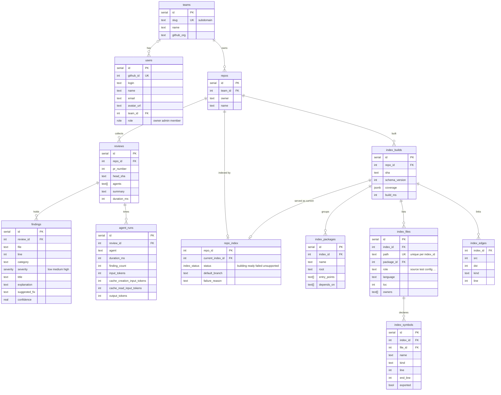

# @pr-review/db

Postgres on Neon, accessed through Drizzle. `db()` returns the client; the
tables are exported from `src/schema.ts`.



- `teams.slug` is the subdomain: `acme` → `acme.<app-domain>`.
- `agent_runs` is one row per agent per review, carrying the four token counters
  the logging events already emit. Nothing writes it yet — see the dashboard's
  `lib/data/`.
- One team per user: `users.team_id`, null until they create or join one.
  Many teams per user later means moving that column into a join table.
- Deleting a team cascades to its repos, reviews and findings; its users stay
  and get `team_id = null`.
- The repository index (`docs/specs/repo-index.md`) lives under one
  `index_builds` row per build; every index table is scoped by `index_id`,
  which is the tenant boundary.
- `src/index-store.ts` writes it: one transaction inserts the build, flips
  `repo_index.current_index_id` to it and deletes the repository's older
  builds, so a review never reads a half-built index. That needs a driver with
  real transactions; `db()` over neon-http has none.
- `index_edges.src`/`dst` are file ids for `imports` and `tests`, symbol ids
  otherwise; `kind` says which. No source text is stored anywhere.
- `index_symbols` is Layer B: created with the rest so the migration is one
  step, empty until the SCIP indexers land.

## Commands

```bash
pnpm db:generate   # write a migration from schema changes
pnpm db:push       # apply the schema straight to DATABASE_URL (dev)
pnpm db:migrate    # apply pending migrations
pnpm db:studio     # browse the data
```

`DATABASE_URL` comes from Vercel in production and from the nearest
`.env.local` locally.

`.github/workflows/db-migrate.yml` runs `db:migrate` against `secrets.DATABASE_URL`
when a merge to `main` adds anything under `drizzle/`; it can also be run by hand.
