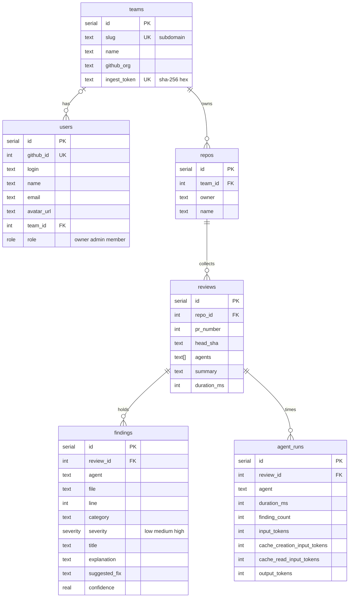

# @pr-review/db

Postgres on Neon, accessed through Drizzle. `db()` returns the client; the
tables are exported from `src/schema.ts`.



- `teams.slug` is the subdomain: `acme` → `acme.<app-domain>`.
- `agent_runs` is one row per agent per review, carrying the four token counters
  the logging events already emit. `ingestReviewRecord` writes it from the
  record's `agentRuns`.
- `teams.ingest_token` holds the SHA-256 hex of the team's ingest secret, never
  the secret. `hashIngestToken` in `src/ingest.ts` computes it.
- `reviews (repo_id, pr_number, head_sha)` is unique: the ingest upsert's
  conflict target, so a rerun of one commit replaces its runs and findings.
- `findings.agent` records which review agent produced the finding; `category`
  stays the finding's own classification.
- One team per user: `users.team_id`, null until they create or join one.
  Many teams per user later means moving that column into a join table.
- Deleting a team cascades to its repos, reviews and findings; its users stay
  and get `team_id = null`.

## Commands

```bash
pnpm db:generate   # write a migration from schema changes
pnpm db:push       # apply the schema straight to DATABASE_URL (dev)
pnpm db:migrate    # apply pending migrations
pnpm db:studio     # browse the data
```

`DATABASE_URL` comes from Vercel in production and from the nearest
`.env.local` locally.

`.github/workflows/db-migrate.yml` runs `db:migrate` against `secrets.DATABASE_URL`
when a merge to `main` adds anything under `drizzle/`; it can also be run by hand.

## Tests

```ts
import { createTestDatabase } from "@pr-review/db/test-database";

const database = await createTestDatabase();
```

An in-memory Postgres (PGlite) with `drizzle/` applied, so tests need no
`DATABASE_URL`. `Database` is driver-agnostic, so anything typed against it
takes the test client as readily as the Neon one.

`ingestReviewRecord` runs its writes one by one: the Neon HTTP driver has no
interactive transactions.
