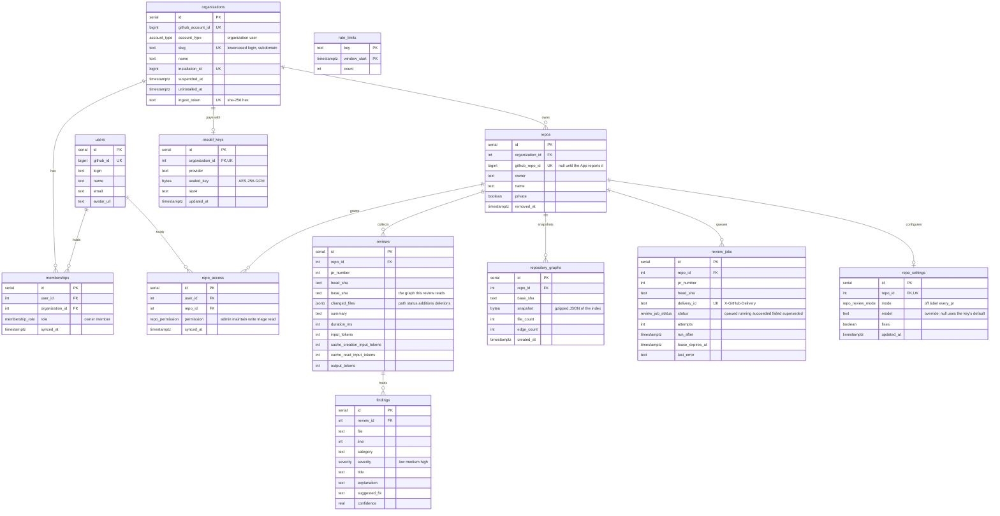

# @pr-review/db

Postgres on Neon, accessed through Drizzle. `db()` returns the client; the
tables are exported from `src/schema.ts`.



- An organization is one GitHub account, an organization or a user.
  `github_account_id` is the durable key; `slug` is the lowercased login and the
  subdomain: `acme` → `acme.<app-domain>`.
- `reviews` carries the run's four token counters, the same ones the logging
  events emit. `ingestReviewRecord` writes them from the record.
- `organizations.ingest_token` holds the SHA-256 hex of the ingest secret, never
  the secret. `hashIngestToken` in `src/ingest.ts` computes it.
- `reviews (repo_id, pr_number, head_sha)` is unique: the ingest upsert's
  conflict target, so a rerun of one commit replaces its runs and findings.
- `findings.category` is the finding's own classification.
- `repository_graphs` is the repository index serialised by `@pr-review/index`,
  gzipped by the reviewer and stored as those exact bytes: ingest only base64
  decodes them, and the web data layer gunzips on read. It is unique on
  `(repo_id, base_sha)`, so every review of one base shares a row, and ingest
  keeps the newest `REPOSITORY_GRAPH_RETENTION` (20) per repo, deleting the
  rest (`src/repository-graphs.ts`). A review whose index was off or failed
  records `base_sha` and `changed_files` and no snapshot.
- `memberships` is unique on `(user_id, organization_id)`: one role per user
  per organization, and a user may belong to any number of organizations.
- `repo_access` is a user's GitHub permission on one repo, unique on
  `(user_id, repo_id)`. A member reads a public repo without a row and a
  private one only with a row; organization owners read every repo
  (`src/repo-access.ts`).
- `repos.github_repo_id` is the key the installation webhook upserts on
  (`src/installations.ts`); a repo ingest recorded first is claimed by owner
  and name, so its reviews stay.
- Uninstalling sets `organizations.uninstalled_at` and removing a repository
  sets `repos.removed_at`; neither deletes a row, so reviews survive a
  reinstall. A hard delete of an organization still cascades to everything
  under it.
- `model_keys` holds one organization's own model key, sealed by
  `src/secret-box.ts` (AES-256-GCM under `MODEL_KEY_ENCRYPTION_KEY`, with the
  organization id as associated data, so a row copied to another organization
  will not open). Only `last4` is ever shown; `readModelKey` is the worker's.
- `review_jobs` is the hosted review queue (`src/review-jobs.ts`). The webhook
  enqueues; `delivery_id` is unique, and a partial unique index allows one
  queued or running job per `(repo_id, pr_number, head_sha)`, so a redelivery
  is a no-op. A new head supersedes the pull request's older active jobs. A
  worker claims the oldest due job in one `UPDATE … WHERE id IN (SELECT … FOR
  UPDATE SKIP LOCKED)`, which takes a lease; a running job whose lease lapsed
  is claimable again. A failure requeues it after a delay until `attempts`
  reaches the limit, then marks it `failed`.
- `repo_settings` is one repository's hosted review settings (`src/repo-settings.ts`).
  A repo with no row reviews every pull request, calls the organization
  key's default model, and offers fixes as suggestions rather than committing
  them — `effectiveRepoSettings` returns those defaults. `model` is a model id
  in the organization key's own provider, not a provider name.
- `rate_limits` counts requests per `(key, window_start)` fixed window
  (`src/rate-limits.ts`); the docs chat keys it on an HMAC of the client
  address, never the address. `consumeRateLimit` is one upsert that increments
  and returns the count, and `pruneRateLimits` drops windows past their use.
  It stands alone, with no foreign keys.

## Commands

```bash
pnpm db:generate   # write a migration from schema changes
pnpm db:push       # apply the schema straight to DATABASE_URL (dev)
pnpm db:migrate    # apply pending migrations
pnpm db:studio     # browse the data
```

`DATABASE_URL` comes from Vercel in production and from the nearest
`.env.local` locally.

`.github/workflows/db-migrate.yml` runs `db:migrate` against `secrets.DATABASE_URL`.
`production.yml` calls it on every push to `main`, after CI passes and before
the web app deploys (see `apps/web/README.md`); it can also be run by hand.

## Tests

```ts
import { createTestDatabase } from "@pr-review/db/test-database";

const database = await createTestDatabase();
```

An in-memory Postgres (PGlite) with `drizzle/` applied, so tests need no
`DATABASE_URL`. `Database` is driver-agnostic, so anything typed against it
takes the test client as readily as the Neon one.

`ingestReviewRecord` runs its writes one by one: the Neon HTTP driver behind
`db()` has no interactive transactions. Writes that must be atomic go through
`withWriteDatabase(run)`, a Neon WebSocket pool opened for `run` and closed
after; `.transaction()` works there and on the test database.
